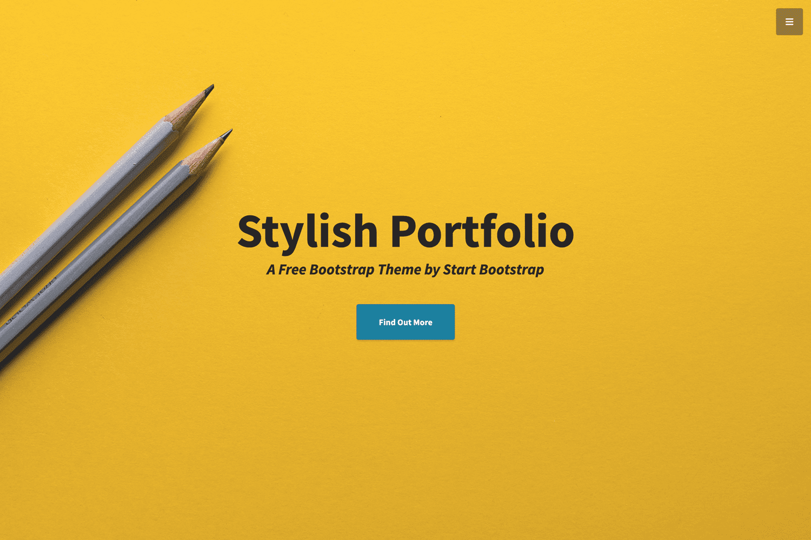

This is a [Next.js](https://nextjs.org/) project based on [Startboostraps StylishPortfolio Template](https://github.com/startbootstrap/startbootstrap-stylish-portfolio)





## Getting Started

* First,clone or download the source code from here
* Then run 
```npm install```

* Lastly,run the development server:


```bash
npm run dev
# or
yarn dev
```

Open [http://localhost:3000](http://localhost:3000) with your browser to see the result.

